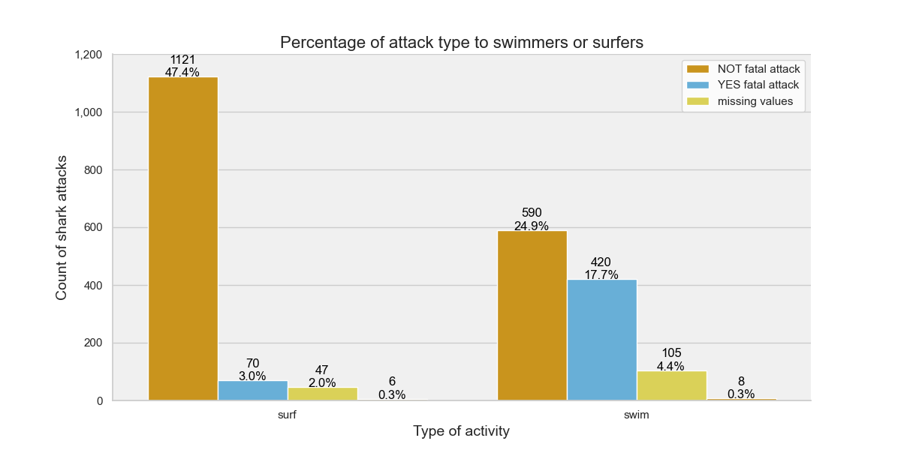
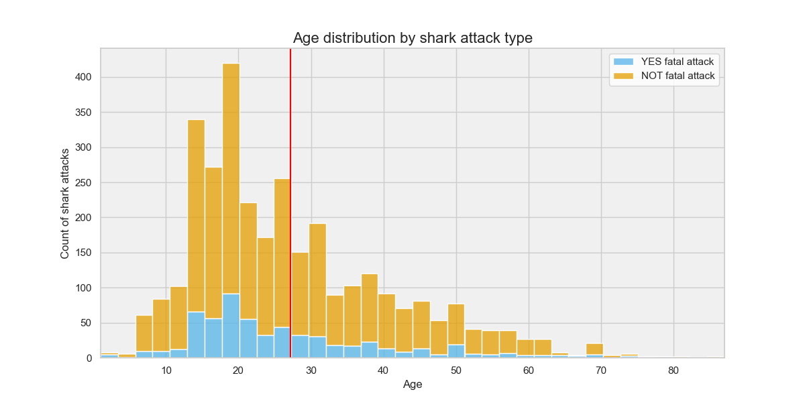
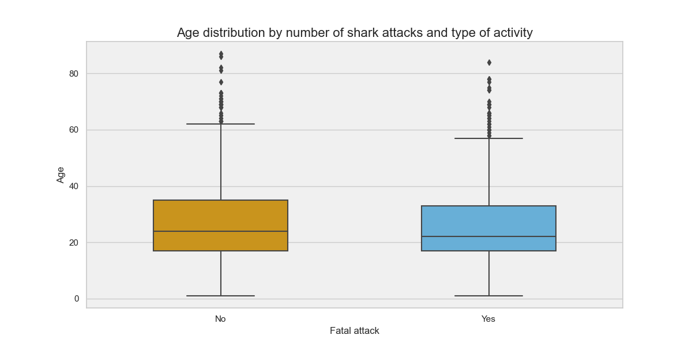
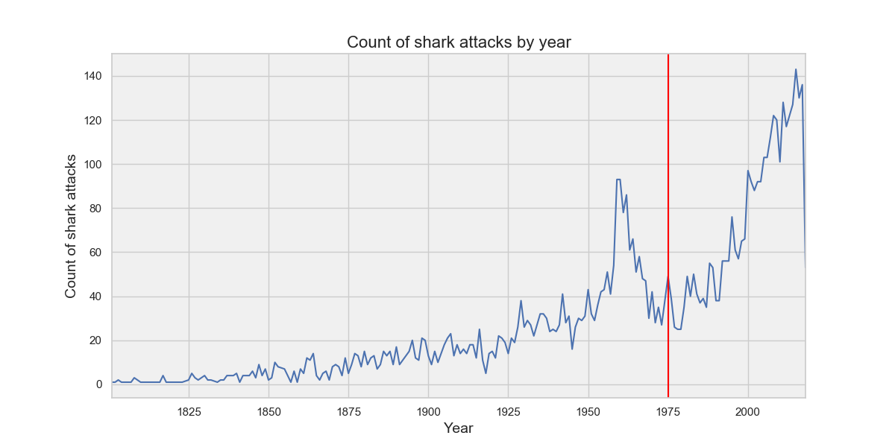

# Project1-Sharks
## Goal
The goal of this project is to analyze the sharks attack database.

## Database description
- Each row of the database refers to a shark attack.
- For each shark attack it is given certain information such as the age of the victim, the species of the shark, the country where it happened, etc.
- The data is mostly qualitative, except for the variables age and time
- The database contains 25.723 rows and 24 columns

## Hypothesis
1. Surfers are more likely to be fataly attacked by a shark than swimmers
2. Young people is more likely to be attacked by a shark than older people
3. The frequency of shark attacks has decreased since the JAWS film was released

## General cleaning:
- Set column names to lowercase and remove leading and trailing whitespaces
- Drop null values
- Drop duplicates
- Drop selected columns useless for the analysis

## Cleaning data - HYPOTHESIS 1
```
Variables involved:
- "activity": refers to the activity carried out by the vitctim at the moment of the shark attack (eg. swimmming, surfing, fishing, etc.)
- "fatal_(y/n)": refers to the type of the shark attack (fatal or not)
```
**General cleaning:**
- Drop null values
- Cast values into string, so it is possible to run string methods

**"activity" cleaning:**
- Set values to lowercase
- Filter to keep only the rows where the "activity" column contains the words "swim" or "surf"
- Create new column called "activity_swim_surf", with values of "swim" or "surf" depending on whether the word "swim" is present in the "activity" column or not

**"fatal_(y/n)" cleaning:**
- Set values to lowercase and remove leading and trailing whitespaces
- Filter to exclude those rows where the value in the "fatal_(y/n)" column is "UNKNOWN"

**Plot results**


## Conclusions - HYPOTHESIS 1
Although both swimmers and surfers have been attacked by sharks almost in the same proportion, swimmmers have been more fataly attacked by sharks than surfers meaning that have suffered from more serious injuries.

## Cleaning data - HYPOTHESIS 2
```
Variables involved:
- "age": age of the victim
- "fatal_(y/n)": refers to the type of the shark attack (fatal or not)
```
**General cleaning:**
- Drop null values
- Cast values into string, so it is possible to run string methods

**"age" cleaning:**
- Set values to lowercase and remove leading and trailing whitespaces
- Target those values whose length is greater than 2 characters meaning that it is a data entry error
- Update the "age" column by extracting the first two characters if the string has more than two characters and contains an "s", otherwise it leaves the original value unchanged (eg. 30s, 40s, etc.)
- Update the "age" column by replacing the substring "teen" with "15"
- Update the "age" column by removing whitespaces and extracting the first two characters from the string if it contains "or" or "to"
- Filter rows where the "age" column contains "&" because as it is referring to more than one person we assume it is not valid data
- Make some manual replacements
- Set the remaining values as "excluded values", because their weight is not significant
- Convert the "age" column to numeric data type

**"fatal_(y/n)" cleaning:**
- Remove leading and trailing whitespaces
- Filter to exclude rows where the "fatal_(y/n)" column contains the value "UNKNOWN", "M" or "2017"
- Update the "fatal_(y/n)" column by replacing "Y" with "Yes" and "N" with "No"

**Plot results**




## Conclusions - HYPOTHESIS 2
Most people who have been attacked by a shark is between 12 and 27 years old, meaning that more young people have been attacked by a shark than old people. The mean of the age of the people that has been attacked by a shark is set to 27 years approximately. Regarding to the shark attack type it follows a similar pattern for both kinds of attack (fatal and not fatal). Eventhough the differente of shark attacks between young and old people is more remarkable for not fatal attacks than fatal attacks. 
As we can see in the boxplot the distribution of the age behaves similar for both attack types. Both distributions have atypical values above 60 years approximately. The only difference, although not significant, is that the width of the box for fatal shark attaks is smaller than the not fatal shark attacks meaning that most of the victims that suffered from a fatal shark attack belong to a lower range of age than the rest of the victims. 

 ## Cleaning data - HYPOTHESIS 3
```
Variables involved:
- "year": year of the shark attack
```
**General cleaning:**
- Drop null values
- Cast values into string, so it is possible to run string methods

**"year" cleaning:**
- Filter the "year" column into include only rows where the values start with "1" or "2".
- Convert the "year" column to numeric type
- Remove rows whose year is previous to 1800 since the number of sharck attacks is not significant

**Plot results**


## Conclusions - HYPOTHESIS 3
The previous years from the release date there was a decrease in the shark attaks, meanwhile from the release date on we observe that the number of the shark attacks has increase and has not stopped increasing until the last year with records. Maybe the number of recordings has increased over time as there is more technology available.  


 
